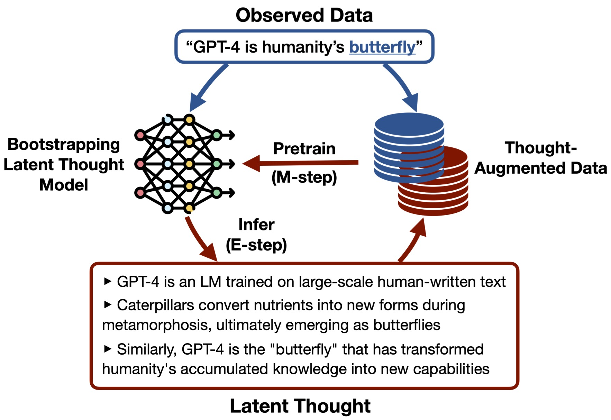

# Reasoning to Learn by Bootstrapping Latent Thoughts

<div align="center" style="font-size: 28px;">
    <a href="https://arxiv.org/abs/2503.18866">📃 Paper</a> &nbsp;&nbsp;|&nbsp;&nbsp;
    <a href="https://huggingface.co/datasets/ryoungj/bootstrap-latent-thought-data">🤗 Data</a> &nbsp;&nbsp;|&nbsp;&nbsp;
    <a href="https://twitter.com/YangjunR/">🐦 Twitter</a>
</div>

<br>

This repo contains the code for our paper [Reasoning to Learn from Latent Thoughts](https://arxiv.org/abs/2503.18866). 

<div align="center">
  
</div>

We introduce a "reasoning to learn" paradigm for data-efficient pretraining of language models (LMs) and model self-improvement on task-agnostic data.
Motivated by how humans apply deliberate thinking to learn from limited data, we train an LM to infer (or “decompress”) latent thoughts underlying the highly compressed observed data. These synthesized latent thoughts augment the raw observed data during pretraining, improving the LM’s data efficiency. This procedure can be iteratively applied through an Expectation-Maximization algorithm and form a model
self-improvement loop where increasingly capable LMs synthesize more effective latent thoughts, which in turn train more capable models -- we call this apporach **Bo**otstrapping **L**atent **T**houghts (**BoLT**).

Our implementation is built upon the [Meta Lingua](https://github.com/facebookresearch/lingua) codebase for LM pretraining.

## Preparation

### Setup Environment


1. Create a conda environment:
```
conda env create -f environment.yaml
conda activate bootstrap-latents
```

2. Install requirements: `bash bin/install_requirements.sh`

3. Create soft links to store large datasets and experiment checkpoints:
```
ln -s [YOUR_SCRATCH_DIR]/data data
ln -s [YOUR_SCRATCH_DIR]/exp_logs exp_logs
```

4. Create a `.env` file with your API keys for synthetic data generation and HuggingFace access:
```
OPENAI_API_KEY=[YOUR_OPENAI_API_KEY]
HF_TOKEN=[YOUR_HF_TOKEN]
```

5. If you are using sphinx, specify the slurm config in `bin/slurm.sh`.

### Prepare Data and Pretrained Checkpoints

1. Download pretrained TinyLlama checkpoints and convert to Lingua-compatible format: `bash bin/prepare_hf_ckpts.sh`

2. Download and preprocess FineMath-4+ dataset: `bash bin/prepare_hf_datasets.sh [DOWNLOAD_PREPROCESSED_DATASETS]`. Setting `DOWNLOAD_PREPROCESSED_DATASETS=true` will download our processed/generated datasets from HuggingFace used in our experiments, otherwise the data processing/generation will be done from scratch. We recommend setting it to either `true` or `false` for the whole experiment setup to ensure consistency (such as the train/val split).

Note that for the specified number of tokens in the dataset name, we have rounded them to the nearest multiple of 500M, and the actual number should be multiplied by 0.96 - so for example, `2b` corresponds to ~1.92B tokens.

## Synthetic Latent Generation Experiments

Here we include the code for synthetically generating latent thoughts with GPT-4o-mini and comparing it with other alternatives in the data-constrained setup such as training repeatedly on the raw data or synthetically generating paraphrases.


1. Prepare the raw data corpus: `bash bin/prepare_data.sh warmstart [DOWNLOAD_PREPROCESSED_DATASETS]`

2. Generate synthetic data using GPT-4o-mini with batch API: `bash bin/run_gen_latents.sh [METHOD] [DOWNLOAD_PREPROCESSED_DATASETS]` with the `[METHOD]` argument specifying the synthetic data generation method selected from {`latent_thoughts`, `wrap_baseline`, `wrap_cot`}.

3. Run the training script with different synthesized data: `bash ./bin/run_train_warmstart.sh [MODE] synth_data_method_compare.sh [DATA_TYPE]`, where:
- `[MODE]` is the mode for executing the script, selected from `cat` (for printing the commands only), `run` (for running the commands locally), `launch` (for submitting the jobs to slurm).
- `[DATA_TYPE]` is the data used for training, selected from {`latent_thoughts`, `raw_repeat`, `raw_fresh`, `wrap_baseline`, `wrap_cot`}.
- The default training setups work for 4xH200 GPUs, adjust `PER_GPU_BATCH_SIZE` in the script to match your GPU setup.

4. Plot the results with [`plot_synth_data_method_compare.ipynb`](plots/plot_synth_data_method_compare.ipynb).


## Bootstrapping Latent Experiments

Here we include the code for bootstrapping latent thought models with self-generated latents on fixed data.


1. Prepare the raw data corpus (~1.92B tokens): `bash bin/prepare_data.sh bootstrap_fixed_data [DOWNLOAD_PREPROCESSED_DATASETS]`.

2. Train warmstart model on a small corpus (~240M raw tokens) with GPT-4o-mini synthetic latents: `bash bin/run_train_warmstart.sh [cat|run|launch] bootstrap_fixed_data.sh`.

3. Start the bootstrapping loop by training with self-generated latents on the fixed raw data corpus. For each iteration `BOOTSTRAP_ITERATION`:
    - Generate the latents from the model trained at the previous iteration. You can choose to:
        - Generate the latents locally by first running `bash bin/run_bootstrap_latents.sh launch bootstrap_fixed_data.sh [BOOTSTRAP_ITERATION]` to launch distributed synthetic data generation jobs (by default, over 200 async jobs) and then `bash bin/run_bootstrap_latents.sh merge bootstrap_fixed_data.sh [BOOTSTRAP_ITERATION]` to merge the generated data.
        - Download our generated datasets: `bash bin/run_bootstrap_latents.sh download bootstrap_fixed_data.sh [BOOTSTRAP_ITERATION]`.
    - Train the model on the generated data: `bash bin/run_train_bootstrap.sh [cat|run|launch] bootstrap_fixed_data.sh [DATA_SETUP] [BOOTSTRAP_ITERATION]`. Setting `DATA_SETUP` to `bootstrap_latent` to train on data augmented with bootstrap latents, and `raw_token_match_baseline` or `raw_flops_match_baseline` to train on raw data. Due to the high run-to-run variance on downstream evaluations, we recommend running at least 3 trials as being set in the script. The default training setup works for 8xH200 GPUs, adjust `PER_GPU_BATCH_SIZE` in the script to match your GPU setup.

4. Run raw-token baseline training: `bash bin/run_train_bootstrap.sh [cat|run|launch] bootstrap_fixed_data.sh [raw_token_match_baseline|raw_flops_match_baseline]`.

5. Plot the results with [`plot_bootstrap_fix_data.ipynb`](plots/plot_bootstrap_fix_data.ipynb).

6. Due to the high variance of few-shot prompting evaluation, we recommend running finetuning-based evaluation that demonstrates smoother performance metrics. 
    - Evaluate the model on the finetune datasets: `bash bin/run_finetune_eval.sh [cat|run|launch] math bootstrap_fixed_data.sh [DATA_SETUP] [BOOTSTRAP_ITERATION]`. To further reduce variance, increase the number of seeds (5 by default) and the number of samples per prompt (`num_samples_per_prompt=16` by default).
    - Plot the results with [`plot_finetune_eval_results.ipynb`](plots/plot_finetune_eval_results.ipynb).


## Citation

```
@article{ruan2025reasoning,
  title={Reasoning to Learn from Latent Thoughts},
  author={Ruan, Yangjun and Band, Neil and Maddison, Chris J and Hashimoto, Tatsunori},
  journal={arXiv preprint arXiv:2503.18866},
  year={2025}
}
```
